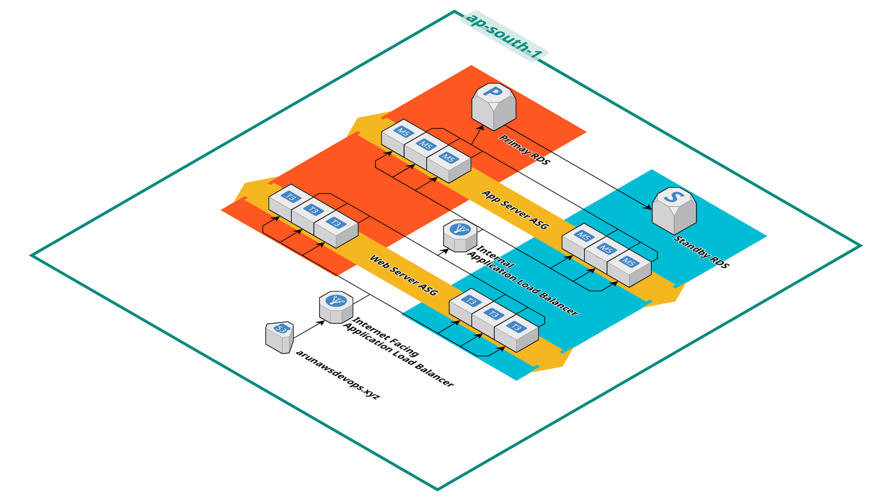

# Three-Tier Architecture Project Steps



## 1. Create a VPC

## 2. Create 6 Subnets

- 2 Subnets for Web Server
- 2 Subnets for App Server
- 2 Subnets for Database

## 3. Create Route Tables

- **Public Route Table**: Connects with Internet Gateway and 2 public subnets.
- **Private Route Table**: Create Private Route table for eachsubnet and Map NatGateway from each Availability zone for High Availability
- **No NAT for Database**: If required for database patching, Map Natgateway to Database Route table

## 4. Create 3 Security Groups
_ **Internet_LB-SG**:Allows SSH (ALL), HTTP (ALL), HTTPS (ALL).
- **WebServer-SG**: Allows SSH, HTTP, HTTPS from Internet_LB-SG.
- **Internal_LB-SG**: Allows SSH, HTTP,5000 HTTPS from WebServer-SG
- **AppServer-SG**: Allows 5000 from Internal_LB-SG, SSH Internal_LB-SG, 80 Internal_LB-SG, 443 Internal_LB-SG.
- **DB-SG**: Allows 3306 from AppServer-SG.


## 5. Create Route 53 (R53) Hosted Zone

- Create a Hosted Zone for a domain name.
- Map R53 NameServer with your Domain Service Provider.

## 6. Validate ACM with R53

- Request a Certificate for your domain name.
- Create a CNAME record in R53 from ACM to validate your domain ownership.

## 7. Create RDS

- Create a DB Subnet group *at least 2 subnets needed*.
- Create a MySQL DB in a private subnet with DB-SG.

## 8. Create Web Server EC2

- Launch an EC2 instance in the public subnet with WebServer-SG.

## 9. Create App Server EC2

- Launch an EC2 instance in the private subnet with AppServer-SG.

## 10. Create Auto Scaling 

- Create for Web server & App Server

## 11. Command to Login to App Server

```bash
vi LearnWithMithran.pem
chmod 400 key.pem
ssh -i key.pem ec2-user@10.0.4.162
```

## 12. Setup Database

```bash
sudo yum install mysql -y
mysql -h ytdb.cpk8oagkgyaz.ap-south-1.rds.amazonaws.com -P 3306 -u admin -p
```

- Provide queries from **commands.sql** file to create DB, tables, and insert data into the table.

## 13. Setup App Server

```bash
sudo yum install python3 python3-pip -y
pip3 install flask flask-mysql-connector flask-cors
vi app.py

nohup python3 app.py > output.log 2>&1 &
ps -ef | grep app.py

cat output.log 
curl http://10.0.3.47:5000/login
```

## 14. Setup Web Server

```bash
sudo yum install httpd -y
sudo service httpd start
cd /var/www/html/
touch index.html script.js styles.css
```

## 15. Create Application Load Balancer (ALB)

- Create **Backend Target Group** for App Server EC2 with:
  - Port: 5000
  - Health Check Path: `/login`
- Create **Backend Load Balancer** in the public subnet with:
  - Listener Port: 80
  - Attach the Target Group
- Create **Frontend Target Group** for Web Server EC2 with:
  - Port: 80
  - Health Check Path: `/`
- Create **Frontend Load Balancer** in the public subnet with:
  - Listener Port: 80
  - Attach the Target Group

## 16. Configure Route 53 to Load Balancer

- Create an **A record** with alias pointing to the Frontend Load Balancer.

## 17. Attach ACM Certificate to Load Balancer

---

